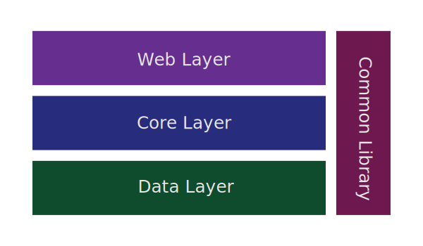

# Shopping Mall Management System

## 原项目介绍
这个项目是 West2 Online - Java 第三轮考核任务。项目简单实现了订单系统的管理，表结构较为简单，只实现了订单与商品的交互，未有权限验证，未考虑与账户系统、物流系统、
支付系统、仓储系统等其他系统的交互。

基本实现增删改查，但复杂的连表查询、子查询无法做到。能进行基本排序、分页和搜索，但搜索无法分词。

~~（前台就不写了吧~~（ ` **·** ω **·** ´ )

## 下一步工作
- **DDD 重构项目架构**
- **接口文档标准化**
- **完善订单系统，并纳入账户系统、物流系统、支付系统、仓储系统等其它系统**
- **RBAC / NGAC 权限访问控制设计**
- **数据层使用 Mybatis Flex / Mybatis Plus 重写**
- 日志记录 Slf4j + Log4j2
- 单元测试 JUnit 5 + Mockito
- 持续集成 Jenkins + GitHub
####
- *并发控制
- *性能测试
- *安全验证

## 原项目基本功能与特性
### 数据库
- **符合数据库三大范式**
- **订单表使用主从表设计**
- **逻辑删除**
- **审计记录**

### 后台
- **使用 Mybatis 作为 ORM 框架**
  - 实现增删改查
  - 分页实现
  - 排序与搜索
  - SQL 注入防止
- **采用 Druid 连接池**
- **AOP 实现数据库事务管理**
- **通过 Spring MVC 暴露路由**
- **JUnit 5 + Mockito 单元测试**

## 原项目结构
### 数据库
- 订单主表 order_manifest
- 订单从表 order_item
- 商品表 product

### 后台
</img>

```text
├───order-management-common 通用类库
│   └───src
│       └───main
│           └───java
│               └───org.neptrueworks.ordermanagement.data
│                    ├───composing   组合
│                    └───exceptions  异常处理
│
├───order-management-data   持久层
│   └───src
│       └───main
│           ├───java
│           │   └───org.neptrueworks.ordermanagement.data
│           │        ├───entitizing  数据实体化
│           │        ├───maneuvering 数据操纵
│           │        ├───mapping     数据映射
│           │        └───reposition  数据查询
│           └───resources
│
├───order-management-core   服务层
│   └───src
│       ├───main
│       │   ├───java
│       │   │   └───org.neptrueworks.ordermanagement.core
│       │   │        ├───exceptions      异常
│       │   │        └───servicing       核心服务
│       │   └───resources
│       │
│       └───test
│           └───java
│                └───org.neptrueworks.ordermanagement.core
│                     └───servicing
│
└───order-management-web    控制层
    └───src
        └───main
            ├───java
            │   └───org.neptrueworks.ordermanagement.web
            │        ├───controlling 控制器
            │        └───modelling   视图模型
            └───resources
```

## 学习感想
- ### 不应当编写关系型数据持久层的测试用例
  **连接数据库的测试不是单元测试，其是集成测试**  
  事实上，数据持久层的测试测的是 SQL 语句的语法和语义正确性；现阶段需要在 DBMS 上首先完成 SQL 验证而不是通过测试完成校验。

  - 程序中不应当出现 DCL，因而不可能出现在测试用例内；
  - 程序中的 DML 并不复杂，不应当浪费时间编写测试用例；
  - 需要测试的是复杂 DQL，这意味着：**我们需要面向对象型数据库。**

- ### 从关系型数据库到面向对象型数据库的历史必然性
  **SQL 是结构化语言，但不是面向对象的**  
  如同 C 语言，SQL 事实上是结构化语言，非面向对象的，因此同时也导致：

  - 没有封装，结构复杂
  - 没有继承，数据冗余
  - 没有多态，拓展性差

- ### 新的对象 - 对象映射框架

- ### 新的数据库单元测试框架的特征
  - 面向对象的，而非关系型的
  - 嵌入式的，而非通用的
  - 通过定义和操纵语言进行伪造操作的
  - 查询语言语法和语义分析的

- ### 领域驱动设计的一瞥
  - 查询后的实体的生命周期应当在各层之间，这意味着其不应当经过翻译为其他对象的操作。
  - 操纵的映射器应当进行组合，而非将服务与映射器一一对应，与其他服务交互形成服务。